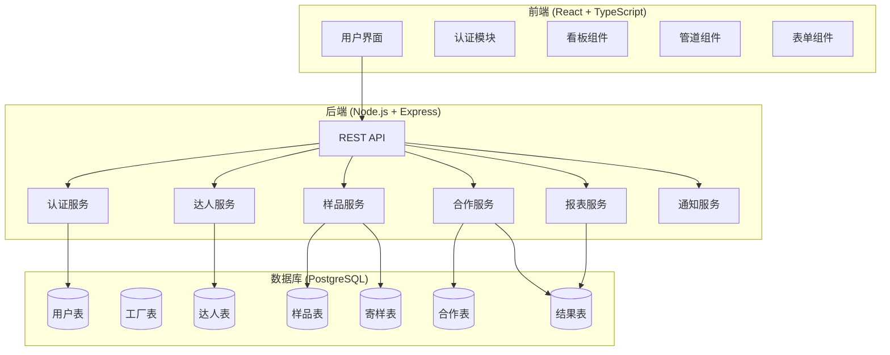
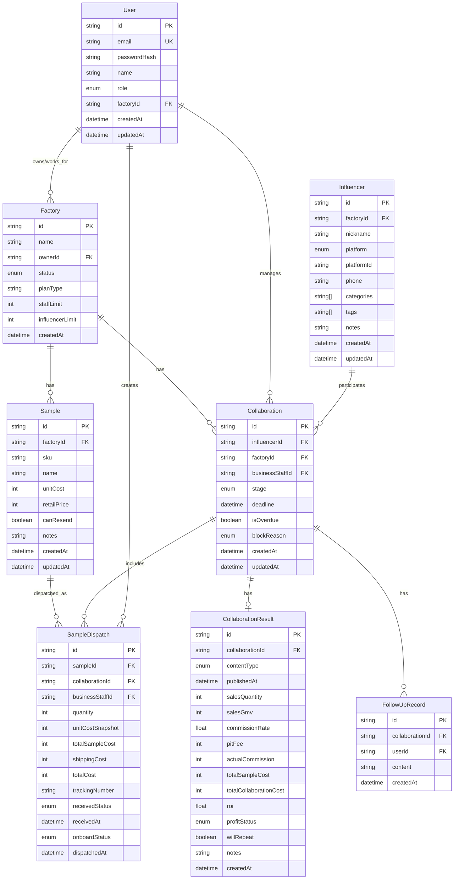

# Design Document

## Overview

本系统是一个面向工厂与商务团队的「达人合作执行与成本管理系统」，采用 Web 应用架构，前端使用 React + TypeScript，后端使用 Node.js + Express，数据库使用 PostgreSQL。

系统核心价值在于：
1. **数据收口**：将散落在飞书/Excel/微信的达人信息统一管理
2. **流程可视化**：通过看板追踪合作进度，防止漏跟进
3. **成本透明**：自动计算样品成本、合作成本、ROI
4. **人效量化**：商务绩效数据化，支持管理决策

## Architecture

### 系统架构图



### 技术栈选择

| 层级 | 技术 | 理由 |
|------|------|------|
| 前端框架 | React 18 + TypeScript | 组件化开发，类型安全 |
| UI组件库 | Ant Design | 企业级组件，看板/表格/表单完善 |
| 状态管理 | Zustand | 轻量级，适合中等复杂度应用 |
| 后端框架 | Node.js + Express | 快速开发，生态丰富 |
| ORM | Prisma | 类型安全，迁移管理方便 |
| 数据库 | PostgreSQL | 关系型数据，支持复杂查询 |
| 认证 | JWT + bcrypt | 无状态认证，安全可靠 |

## Components and Interfaces

### 1. 认证模块 (AuthService)

```typescript
interface AuthService {
  // 用户注册
  register(data: RegisterInput): Promise<User>;
  // 用户登录
  login(credentials: LoginInput): Promise<AuthToken>;
  // 验证Token
  verifyToken(token: string): Promise<TokenPayload>;
  // 刷新Token
  refreshToken(refreshToken: string): Promise<AuthToken>;
}

interface RegisterInput {
  email: string;
  password: string;
  name: string;
  role: UserRole;
  factoryId?: string; // 商务人员需关联工厂
}

interface LoginInput {
  email: string;
  password: string;
}

interface AuthToken {
  accessToken: string;
  refreshToken: string;
  expiresIn: number;
}

type UserRole = 'PLATFORM_ADMIN' | 'FACTORY_OWNER' | 'BUSINESS_STAFF';
```

### 2. 达人服务 (InfluencerService)

```typescript
interface InfluencerService {
  // 创建达人
  create(data: CreateInfluencerInput): Promise<Influencer>;
  // 批量导入
  batchImport(file: File, mapping: FieldMapping): Promise<ImportResult>;
  // 查询达人列表
  list(filter: InfluencerFilter, pagination: Pagination): Promise<PaginatedResult<Influencer>>;
  // 获取达人详情
  getById(id: string): Promise<Influencer>;
  // 更新达人
  update(id: string, data: UpdateInfluencerInput): Promise<Influencer>;
  // 检查重复
  checkDuplicate(phone?: string, platformId?: string): Promise<Influencer | null>;
  // 添加标签
  addTags(id: string, tags: string[]): Promise<Influencer>;
}

interface CreateInfluencerInput {
  nickname: string;
  platform: Platform;
  platformId: string;
  phone?: string;
  category: string[];
  tags?: string[];
  notes?: string;
}

interface InfluencerFilter {
  keyword?: string;
  category?: string;
  tags?: string[];
  pipelineStage?: PipelineStage;
  businessStaffId?: string;
}

type Platform = 'DOUYIN' | 'KUAISHOU' | 'XIAOHONGSHU' | 'WEIBO' | 'OTHER';
```

### 3. 样品服务 (SampleService)

```typescript
interface SampleService {
  // 创建样品
  create(data: CreateSampleInput): Promise<Sample>;
  // 查询样品列表
  list(filter: SampleFilter, pagination: Pagination): Promise<PaginatedResult<Sample>>;
  // 更新样品
  update(id: string, data: UpdateSampleInput): Promise<Sample>;
  // 创建寄样记录
  createDispatch(data: CreateDispatchInput): Promise<SampleDispatch>;
  // 更新寄样状态
  updateDispatchStatus(id: string, status: DispatchStatus): Promise<SampleDispatch>;
  // 获取样品成本报表
  getSampleCostReport(factoryId: string, dateRange: DateRange): Promise<SampleCostReport>;
}

interface CreateSampleInput {
  sku: string;
  name: string;
  unitCost: number; // 单件成本（分）
  retailPrice: number; // 建议零售价（分）
  canResend: boolean;
  notes?: string;
}

interface CreateDispatchInput {
  sampleId: string;
  influencerId: string;
  quantity: number;
  shippingCost: number; // 快递费（分）
  trackingNumber?: string;
}

interface SampleDispatch {
  id: string;
  sampleId: string;
  influencerId: string;
  businessStaffId: string;
  quantity: number;
  unitCost: number; // 快照，防止样品成本变更影响历史
  totalSampleCost: number; // quantity * unitCost
  shippingCost: number;
  totalCost: number; // totalSampleCost + shippingCost
  dispatchedAt: Date;
  receivedStatus: 'PENDING' | 'RECEIVED' | 'LOST';
  receivedAt?: Date;
  onboardStatus: 'UNKNOWN' | 'ONBOARD' | 'NOT_ONBOARD';
}
```

### 4. 合作服务 (CollaborationService)

```typescript
interface CollaborationService {
  // 创建合作记录
  create(data: CreateCollaborationInput): Promise<Collaboration>;
  // 更新合作阶段
  updateStage(id: string, stage: PipelineStage, notes?: string): Promise<Collaboration>;
  // 设置截止时间
  setDeadline(id: string, deadline: Date): Promise<Collaboration>;
  // 添加跟进记录
  addFollowUp(id: string, content: string): Promise<FollowUpRecord>;
  // 标记卡点原因
  setBlockReason(id: string, reason: BlockReason): Promise<Collaboration>;
  // 录入合作结果
  recordResult(id: string, data: CollaborationResultInput): Promise<CollaborationResult>;
  // 获取管道视图数据
  getPipelineView(factoryId: string, filter?: PipelineFilter): Promise<PipelineView>;
}

interface Collaboration {
  id: string;
  influencerId: string;
  factoryId: string;
  businessStaffId: string;
  stage: PipelineStage;
  deadline?: Date;
  isOverdue: boolean;
  blockReason?: BlockReason;
  followUps: FollowUpRecord[];
  dispatches: SampleDispatch[];
  result?: CollaborationResult;
  createdAt: Date;
  updatedAt: Date;
}

type PipelineStage = 
  | 'LEAD'        // 线索达人
  | 'CONTACTED'   // 已联系
  | 'QUOTED'      // 已报价
  | 'SAMPLED'     // 已寄样
  | 'SCHEDULED'   // 已排期
  | 'PUBLISHED'   // 已发布
  | 'REVIEWED';   // 已复盘

type BlockReason = 'PRICE_HIGH' | 'DELAYED' | 'UNCOOPERATIVE' | 'OTHER';

interface CollaborationResultInput {
  contentType: 'SHORT_VIDEO' | 'LIVE_STREAM';
  publishedAt: Date;
  salesQuantity: number;
  salesGmv: number; // 销售GMV（分）
  commissionRate?: number; // 佣金比例（百分比）
  pitFee?: number; // 坑位费（分）
  actualCommission: number; // 实付佣金（分）
  willRepeat: boolean; // 是否复投
  notes?: string;
}

interface CollaborationResult {
  id: string;
  collaborationId: string;
  contentType: 'SHORT_VIDEO' | 'LIVE_STREAM';
  publishedAt: Date;
  salesQuantity: number;
  salesGmv: number;
  commissionRate?: number;
  pitFee: number;
  actualCommission: number;
  // 自动计算字段
  totalSampleCost: number; // 关联寄样的总成本
  totalCollaborationCost: number; // totalSampleCost + pitFee + actualCommission
  roi: number; // salesGmv / totalCollaborationCost
  profitStatus: 'LOSS' | 'BREAK_EVEN' | 'PROFIT' | 'HIGH_PROFIT';
  willRepeat: boolean;
  notes?: string;
}
```

### 5. 报表服务 (ReportService)

```typescript
interface ReportService {
  // 获取ROI报表
  getRoiReport(factoryId: string, groupBy: 'influencer' | 'sample' | 'staff' | 'month', dateRange: DateRange): Promise<RoiReport>;
  // 获取商务绩效报表
  getStaffPerformance(factoryId: string, dateRange: DateRange): Promise<StaffPerformanceReport>;
  // 获取工厂看板数据
  getFactoryDashboard(factoryId: string): Promise<FactoryDashboard>;
  // 导出报表
  exportReport(reportType: ReportType, params: ExportParams): Promise<Buffer>;
}
```

### 6. 商务账号管理服务 (StaffManagementService)

```typescript
interface StaffManagementService {
  // 获取工厂商务账号列表
  listStaff(factoryId: string, pagination: Pagination): Promise<PaginatedResult<StaffMember>>;
  // 获取商务账号详情（含工作统计）
  getStaffDetail(staffId: string): Promise<StaffDetail>;
  // 创建商务账号（检查配额）
  createStaff(factoryId: string, data: CreateStaffInput): Promise<StaffMember>;
  // 更新商务账号状态（启用/禁用）
  updateStaffStatus(staffId: string, status: 'ACTIVE' | 'DISABLED'): Promise<StaffMember>;
  // 删除商务账号（保留业务数据）
  deleteStaff(staffId: string): Promise<void>;
  // 检查配额使用情况
  getQuotaUsage(factoryId: string): Promise<QuotaUsage>;
}

interface StaffMember {
  id: string;
  name: string;
  email: string;
  status: 'ACTIVE' | 'DISABLED';
  factoryJoinedAt: Date;
  createdAt: Date;
}

interface StaffDetail extends StaffMember {
  // 工作统计
  stats: {
    influencerCount: number; // 管理的达人数量
    collaborationCount: number; // 创建的合作数量
    dispatchCount: number; // 寄样次数
    closedDeals: number; // 成交数量
    totalGmv: number; // 总GMV
  };
}

interface CreateStaffInput {
  name: string;
  email: string;
  password: string; // 初始密码
}

interface QuotaUsage {
  staff: {
    current: number; // 当前商务账号数量
    limit: number; // 配额上限
    available: number; // 剩余配额
    isReached: boolean; // 是否达到上限
  };
  influencer: {
    current: number; // 当前达人数量
    limit: number; // 配额上限
    available: number; // 剩余配额
    isReached: boolean; // 是否达到上限
  };
}

interface FactoryDashboard {
  // 关键指标
  metrics: {
    totalSampleCost: number;
    totalCollaborationCost: number;
    totalGmv: number;
    overallRoi: number;
    periodComparison: {
      sampleCostChange: number; // 环比变化百分比
      gmvChange: number;
      roiChange: number;
    };
  };
  // 管道分布
  pipelineDistribution: Record<PipelineStage, number>;
  // 待办事项
  pendingItems: {
    overdueCollaborations: number;
    pendingReceipts: number;
    pendingResults: number;
  };
  // 商务排行
  staffRanking: {
    staffId: string;
    staffName: string;
    closedDeals: number;
    totalGmv: number;
  }[];
}

interface StaffPerformanceReport {
  staffId: string;
  staffName: string;
  // 数量指标
  contactedCount: number;
  progressedCount: number;
  closedCount: number;
  // 金额指标
  totalGmv: number;
  totalCost: number;
  averageRoi: number;
  // 样品指标
  dispatchCount: number;
  dispatchCost: number;
}
```

## Data Models

### 数据库ER图



### 金额存储说明

所有金额字段使用整数存储（单位：分），避免浮点数精度问题：
- `unitCost`: 单件成本（分）
- `shippingCost`: 快递费（分）
- `salesGmv`: 销售GMV（分）
- `pitFee`: 坑位费（分）
- `actualCommission`: 实付佣金（分）

前端展示时除以100转换为元。


## Correctness Properties

*A property is a characteristic or behavior that should hold true across all valid executions of a system—essentially, a formal statement about what the system should do. Properties serve as the bridge between human-readable specifications and machine-verifiable correctness guarantees.*

### Property 1: 角色权限隔离

*For any* 用户和功能路径组合，如果用户角色没有该功能的访问权限，则系统应拒绝访问并返回权限错误。

**Validates: Requirements 1.2, 1.3, 1.4, 1.5, 1.6**

### Property 2: 达人去重检测

*For any* 达人数据集，如果存在两条记录具有相同的手机号或相同的平台账号ID，则系统应识别为重复并阻止创建或提示合并。

**Validates: Requirements 2.3**

### Property 3: 达人搜索结果一致性

*For any* 达人数据集和搜索条件，返回的所有达人记录都应满足搜索条件（昵称包含关键词、类目匹配、标签匹配等）。

**Validates: Requirements 2.5**

### Property 4: 寄样成本计算正确性

*For any* 寄样记录，寄样总成本应等于（寄样数量 × 样品单件成本 + 快递费用），且所有金额计算不应产生浮点精度误差。

**Validates: Requirements 3.4, 3.5**

### Property 5: 样品成本报表聚合正确性

*For any* 工厂的样品和寄样记录集合，样品成本报表中的累计寄样数量应等于所有寄样记录数量之和，累计成本应等于所有寄样总成本之和，签收率应等于已签收数量/总数量，上车率应等于已上车数量/总数量。

**Validates: Requirements 3.7**

### Property 6: 合作阶段状态一致性

*For any* 合作记录，其阶段状态应为预定义的7个阶段之一（线索达人、已联系、已报价、已寄样、已排期、已发布、已复盘），且每次状态变更都应记录变更时间。

**Validates: Requirements 4.1, 4.2**

### Property 7: 超期判断正确性

*For any* 设置了截止时间的合作记录，如果当前时间超过截止时间且合作阶段未推进，则isOverdue应为true。

**Validates: Requirements 4.4**

### Property 8: ROI计算与回本状态判断

*For any* 合作结果记录：
- 合作总成本 = 关联寄样总成本 + 坑位费 + 实付佣金
- ROI = 销售GMV / 合作总成本
- 回本状态：ROI < 1 为 LOSS，1 <= ROI < 3 为 PROFIT，ROI >= 3 为 HIGH_PROFIT

**Validates: Requirements 5.2, 5.3, 5.4**

### Property 9: ROI报表分组聚合正确性

*For any* 工厂的合作结果集合和分组维度（达人/样品/商务/时间段），分组后的汇总ROI应等于该分组内所有合作的总GMV除以总成本。

**Validates: Requirements 5.5**

### Property 10: 商务绩效统计正确性

*For any* 商务人员和时间范围，其绩效数据应满足：
- 建联数量 = 该商务创建的合作记录数
- 推进数量 = 阶段从线索推进到后续阶段的合作数
- 成交数量 = 阶段达到已发布或已复盘的合作数
- 总GMV = 该商务负责的所有合作结果GMV之和
- 平均ROI = 总GMV / 总成本

**Validates: Requirements 6.1, 6.2, 6.3, 6.4**

### Property 11: 看板指标聚合正确性

*For any* 工厂和时间范围，看板显示的指标应满足：
- 总寄样成本 = 所有寄样记录总成本之和
- 总合作成本 = 所有合作结果总成本之和
- 总GMV = 所有合作结果GMV之和
- 整体ROI = 总GMV / 总合作成本

**Validates: Requirements 7.1**

### Property 12: 数据导入导出Round-Trip

*For any* 有效的达人/寄样/合作数据集，导出为Excel后再导入，应产生与原数据等价的记录（忽略系统生成的ID和时间戳）。

**Validates: Requirements 9.1, 9.2, 9.3, 9.4**

### Property 13: 套餐配额限制

*For any* 工厂和其套餐配置，当商务账号数量达到staffLimit或达人数量达到influencerLimit时，系统应拒绝新增操作。

**Validates: Requirements 8.2, 8.3**

### Property 14: 通知触发条件正确性

*For any* 合作记录和当前时间：
- 如果截止时间 - 当前时间 <= 1天 且 > 0，应触发即将到期提醒
- 如果当前时间 > 截止时间 且 阶段未推进，应触发超期提醒
- 如果寄样时间 + 7天 < 当前时间 且 签收状态为未签收，应触发签收提醒
- 如果上车状态为已上车 且 发布时间 + 14天 < 当前时间 且 无结果记录，应触发结果录入提醒

**Validates: Requirements 10.1, 10.2, 10.3, 10.4**

### Property 15: 商务账号配额检查正确性

*For any* 工厂和其套餐配置，当尝试创建新商务账号时：
- 如果当前商务账号数量 < staffLimit，应允许创建
- 如果当前商务账号数量 >= staffLimit，应拒绝创建并返回配额超限错误
- 配额使用情况应实时反映当前状态（current, limit, available, isReached）

**Validates: Requirements 12.2, 12.3, 12.4**

### Property 16: 商务账号删除数据保留

*For any* 商务账号和其创建的业务数据（达人、合作、寄样记录），当删除该商务账号时：
- 商务账号的用户记录应被删除
- 该商务创建的达人记录应保留（factoryId 不变）
- 该商务创建的合作记录应保留（businessStaffId 保留但用户不可登录）
- 该商务创建的寄样记录应保留
- 工厂老板和其他商务仍可查看这些业务数据

**Validates: Requirements 12.8, 12.9**

## Error Handling

### 认证错误
- 登录失败：返回401，提示"邮箱或密码错误"
- Token过期：返回401，提示"登录已过期，请重新登录"
- 权限不足：返回403，提示"您没有权限执行此操作"

### 数据验证错误
- 必填字段缺失：返回400，列出缺失字段
- 数据格式错误：返回400，说明具体字段和期望格式
- 重复数据：返回409，提示重复的字段和已存在的记录ID

### 业务逻辑错误
- 配额超限：返回403，提示"已达到套餐上限，请升级套餐"
- 状态不允许：返回400，提示"当前状态不允许此操作"
- 关联数据不存在：返回404，提示具体缺失的关联数据

### 系统错误
- 数据库错误：返回500，记录详细日志，返回通用错误信息
- 外部服务错误：返回503，提示"服务暂时不可用，请稍后重试"

## Testing Strategy

### 单元测试
- 使用 Jest 作为测试框架
- 覆盖所有服务层的业务逻辑
- 重点测试：
  - 成本计算函数
  - ROI计算函数
  - 回本状态判断函数
  - 超期判断函数
  - 权限检查函数

### 属性测试 (Property-Based Testing)
- 使用 fast-check 库
- 每个属性测试运行至少100次迭代
- 重点验证：
  - Property 4: 寄样成本计算
  - Property 8: ROI计算与回本状态
  - Property 10: 商务绩效统计
  - Property 12: 数据导入导出Round-Trip

### 集成测试
- 使用 Supertest 测试API端点
- 使用测试数据库（PostgreSQL）
- 覆盖完整的用户流程：
  - 注册 → 登录 → 创建达人 → 创建样品 → 寄样 → 录入结果 → 查看报表

### E2E测试
- 使用 Playwright
- 覆盖关键用户场景：
  - 商务完整工作流
  - 工厂老板看板查看
  - 数据导入导出
