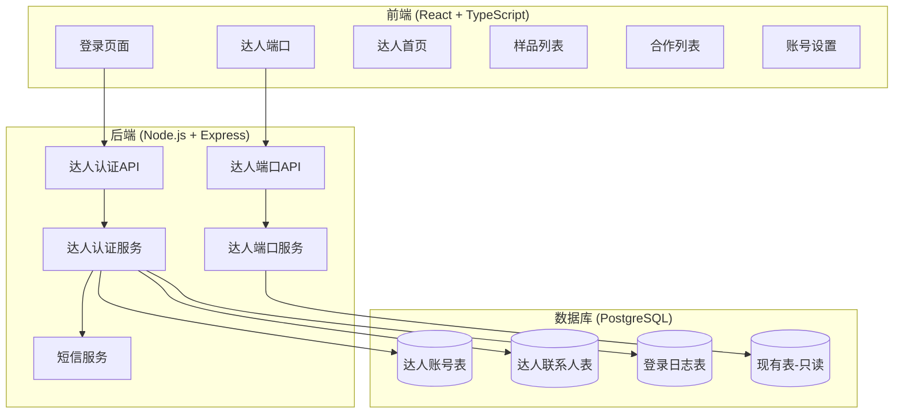
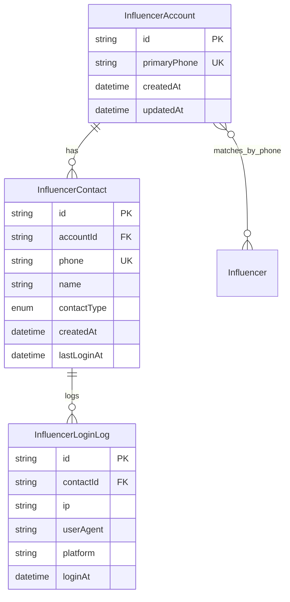

# Design Document: 达人端口

> Language Rule  
> 本项目所有说明性文本、设计说明、任务拆解均使用中文输出。
> 仅代码、API、变量名使用英文。

## Overview

本设计文档描述「达人端口」功能的技术实现方案。该功能为现有系统新增一个独立的达人登录入口，让达人可以通过手机号+验证码登录，查看平台内所有工厂给他寄的样品和合作信息。

核心设计原则：
1. **只新增，不修改**：不改动现有商务端/老板端的任何代码和数据库表
2. **独立路由**：使用 `/api/influencer-portal/*` 独立路由，与现有 API 完全隔离
3. **跨工厂聚合**：通过手机号关联，聚合所有工厂的样品数据
4. **敏感信息隔离**：不向达人展示成本、ROI等敏感信息

## Architecture

### 系统架构图



### 路由隔离设计

```
现有路由（不修改）:
  /api/auth/*           - 商务/老板认证
  /api/influencers/*    - 达人管理（工厂端）
  /api/samples/*        - 样品管理
  /api/collaborations/* - 合作管理
  
新增路由（独立）:
  /api/influencer-portal/auth/*     - 达人认证
  /api/influencer-portal/samples/*  - 达人查看样品
  /api/influencer-portal/collabs/*  - 达人查看合作
  /api/influencer-portal/account/*  - 达人账号管理
```

## Components and Interfaces

### 1. 达人认证服务 (InfluencerAuthService)

```typescript
interface InfluencerAuthService {
  // 发送验证码
  sendVerificationCode(phone: string): Promise<void>;
  // 验证码登录（首次登录自动注册）
  loginWithCode(phone: string, code: string, deviceInfo: DeviceInfo): Promise<InfluencerAuthToken>;
  // 验证Token
  verifyInfluencerToken(token: string): Promise<InfluencerTokenPayload>;
  // 刷新Token
  refreshInfluencerToken(refreshToken: string): Promise<InfluencerAuthToken>;
}

interface DeviceInfo {
  userAgent: string;
  ip: string;
  platform?: string;
}

interface InfluencerAuthToken {
  accessToken: string;
  refreshToken: string;
  expiresIn: number;
  accountId: string;
  contactId: string;
}

interface InfluencerTokenPayload {
  accountId: string;
  contactId: string;
  phone: string;
  contactType: ContactType;
}

type ContactType = 'SELF' | 'ASSISTANT' | 'AGENT' | 'OTHER';
```

### 2. 达人端口服务 (InfluencerPortalService)

```typescript
interface InfluencerPortalService {
  // 获取达人首页数据
  getDashboard(accountId: string): Promise<InfluencerDashboard>;
  // 获取样品列表（跨工厂聚合）
  getSamples(accountId: string, filter: SampleFilter): Promise<InfluencerSampleList>;
  // 获取合作列表
  getCollaborations(accountId: string, filter: CollabFilter): Promise<InfluencerCollabList>;
  // 获取合作详情
  getCollaborationDetail(accountId: string, collabId: string): Promise<InfluencerCollabDetail>;
  // 确认签收样品
  confirmSampleReceived(accountId: string, dispatchId: string): Promise<void>;
}

interface InfluencerDashboard {
  // 样品统计
  sampleStats: {
    total: number;
    pending: number;    // 待签收
    received: number;   // 已签收
  };
  // 合作统计
  collabStats: {
    total: number;
    inProgress: number;
    completed: number;
  };
  // 最近样品（最新5条）
  recentSamples: InfluencerSampleItem[];
}

interface InfluencerSampleItem {
  id: string;
  sampleName: string;
  factoryName: string;      // 工厂名称（脱敏）
  dispatchedAt: Date;
  trackingNumber?: string;
  receivedStatus: ReceivedStatus;
  receivedAt?: Date;
  // 注意：不包含 unitCost, totalCost 等敏感信息
}

interface InfluencerSampleList {
  items: InfluencerSampleItem[];
  total: number;
  // 按工厂分组
  groupedByFactory: {
    factoryId: string;
    factoryName: string;
    samples: InfluencerSampleItem[];
  }[];
}

interface InfluencerCollabItem {
  id: string;
  factoryName: string;
  stage: PipelineStage;
  deadline?: Date;
  isOverdue: boolean;
  sampleCount: number;
  createdAt: Date;
  // 注意：不包含 blockReason, 内部备注等敏感信息
}

interface InfluencerCollabDetail {
  id: string;
  factoryName: string;
  stage: PipelineStage;
  deadline?: Date;
  isOverdue: boolean;
  samples: InfluencerSampleItem[];
  // 阶段变更历史（脱敏）
  stageHistory: {
    stage: PipelineStage;
    changedAt: Date;
  }[];
  // 注意：不包含 followUps, blockReason, result 等敏感信息
}
```

### 3. 达人账号管理服务 (InfluencerAccountService)

```typescript
interface InfluencerAccountService {
  // 获取账号信息
  getAccount(accountId: string): Promise<InfluencerAccountInfo>;
  // 获取联系人列表
  getContacts(accountId: string): Promise<InfluencerContact[]>;
  // 添加联系人
  addContact(accountId: string, data: AddContactInput): Promise<InfluencerContact>;
  // 移除联系人
  removeContact(accountId: string, contactId: string): Promise<void>;
  // 更新联系人信息
  updateContact(accountId: string, contactId: string, data: UpdateContactInput): Promise<InfluencerContact>;
}

interface InfluencerAccountInfo {
  id: string;
  primaryPhone: string;
  createdAt: Date;
  lastLoginAt?: Date;
  contacts: InfluencerContact[];
}

interface InfluencerContact {
  id: string;
  accountId: string;
  phone: string;
  name?: string;
  contactType: ContactType;
  createdAt: Date;
  lastLoginAt?: Date;
}

interface AddContactInput {
  phone: string;
  name?: string;
  contactType: ContactType;
}

interface UpdateContactInput {
  name?: string;
  contactType?: ContactType;
}
```

## Data Models

### 新增数据库表



### Prisma Schema 新增

```prisma
// 达人联系人类型
enum ContactType {
  SELF       // 本人
  ASSISTANT  // 助理
  AGENT      // 经纪人
  OTHER      // 其他
}

// 达人账号（独立于工厂的达人身份）
model InfluencerAccount {
  id           String   @id @default(uuid())
  primaryPhone String   @unique  // 主手机号
  createdAt    DateTime @default(now())
  updatedAt    DateTime @updatedAt

  // Relations
  contacts InfluencerContact[]

  @@index([primaryPhone])
}

// 达人联系人（支持多联系人）
model InfluencerContact {
  id          String      @id @default(uuid())
  accountId   String
  phone       String      @unique  // 联系人手机号
  name        String?     // 联系人姓名
  contactType ContactType @default(SELF)
  createdAt   DateTime    @default(now())
  lastLoginAt DateTime?

  // Relations
  account   InfluencerAccount    @relation(fields: [accountId], references: [id])
  loginLogs InfluencerLoginLog[]

  @@index([accountId])
  @@index([phone])
}

// 达人登录日志（安全审计）
model InfluencerLoginLog {
  id        String   @id @default(uuid())
  contactId String
  ip        String
  userAgent String
  platform  String?
  loginAt   DateTime @default(now())

  // Relations
  contact InfluencerContact @relation(fields: [contactId], references: [id])

  @@index([contactId])
  @@index([loginAt])
}
```

### 数据关联逻辑

达人端口通过手机号关联现有数据：

```typescript
// 查询达人在所有工厂的样品
async function getInfluencerSamples(phone: string): Promise<SampleDispatch[]> {
  // 1. 通过手机号找到所有工厂中匹配的达人记录
  const influencers = await prisma.influencer.findMany({
    where: { phone: phone }
  });
  
  // 2. 获取这些达人的所有合作记录
  const influencerIds = influencers.map(i => i.id);
  const collaborations = await prisma.collaboration.findMany({
    where: { influencerId: { in: influencerIds } }
  });
  
  // 3. 获取这些合作的所有寄样记录
  const collabIds = collaborations.map(c => c.id);
  const dispatches = await prisma.sampleDispatch.findMany({
    where: { collaborationId: { in: collabIds } },
    include: {
      sample: { select: { name: true, sku: true } },
      collaboration: {
        include: {
          factory: { select: { id: true, name: true } }
        }
      }
    }
  });
  
  return dispatches;
}
```

## Correctness Properties

*A property is a characteristic or behavior that should hold true across all valid executions of a system—essentially, a formal statement about what the system should do. Properties serve as the bridge between human-readable specifications and machine-verifiable correctness guarantees.*

### Property 1: 首次登录自动创建账号和联系人

*For any* 新手机号首次登录，系统应自动创建一个 InfluencerAccount 记录和一个 contactType 为 SELF 的 InfluencerContact 记录。

**Validates: Requirements 11.3, 12.1**

### Property 2: 验证码验证正确性

*For any* 手机号和验证码组合，如果验证码错误或已过期（超过5分钟），系统应拒绝登录并返回错误。

**Validates: Requirements 11.5**

### Property 3: 登录审计日志完整性

*For any* 成功的登录操作，系统应创建一条 InfluencerLoginLog 记录，包含 contactId、IP、userAgent 和登录时间。

**Validates: Requirements 11.6, 12.6**

### Property 4: 联系人数据一致性

*For any* 同一 InfluencerAccount 下的多个联系人，使用各自手机号登录后，应看到完全相同的样品和合作数据。

**Validates: Requirements 12.4**

### Property 5: 联系人权限撤销即时性

*For any* 被移除的联系人，其 Token 应立即失效，无法再访问任何达人端口 API。

**Validates: Requirements 12.5**

### Property 6: 样品数据跨工厂聚合正确性

*For any* 达人账号，其样品列表应包含所有工厂中与该达人手机号匹配的寄样记录，且按工厂正确分组。

**Validates: Requirements 13.2, 13.3**

### Property 7: 样品筛选结果正确性

*For any* 达人账号和筛选条件（工厂、状态、时间范围），返回的样品列表应仅包含满足所有筛选条件的记录。

**Validates: Requirements 13.4**

### Property 8: 敏感信息隔离

*For any* 达人端口 API 返回的数据，不应包含以下敏感字段：unitCost、totalCost、totalSampleCost、shippingCost、roi、profitStatus、actualCommission、pitFee、blockReason、notes（工厂内部备注）。

**Validates: Requirements 13.6, 14.5**

### Property 9: 签收状态同步

*For any* 达人确认签收操作，应同时更新 SampleDispatch 的 receivedStatus 为 RECEIVED，并设置 receivedAt 为当前时间，且工厂端查询应能看到更新后的状态。

**Validates: Requirements 15.2, 15.3**

### Property 10: 签收通知触发

*For any* 达人确认签收操作，系统应向负责该合作的商务人员发送一条通知。

**Validates: Requirements 15.4**

### Property 11: 达人数据隔离

*For any* 达人账号查询，返回的数据应仅包含与该账号手机号关联的记录，不应包含其他达人的任何数据。

**Validates: Requirements 16.1, 16.2**

### Property 12: 工厂信息脱敏

*For any* 达人端口返回的工厂信息，应仅包含工厂名称（name），不应包含 ownerId、status、planType、staffLimit、influencerLimit 等内部信息。

**Validates: Requirements 16.3**

### Property 13: API 路由隔离

*For any* 达人端口请求，应通过 `/api/influencer-portal/*` 路由处理，且该路由应使用独立的达人身份验证中间件。

**Validates: Requirements 16.4, 16.5**

## Error Handling

### 认证错误
- 验证码错误：返回 401，提示"验证码错误，请重新输入"
- 验证码过期：返回 401，提示"验证码已过期，请重新获取"
- Token 无效：返回 401，提示"登录已失效，请重新登录"
- 联系人已被移除：返回 403，提示"您的访问权限已被撤销"

### 数据访问错误
- 无权访问：返回 403，提示"您没有权限访问此数据"
- 数据不存在：返回 404，提示"数据不存在"
- 非达人用户访问：返回 403，提示"此接口仅限达人用户访问"

### 业务逻辑错误
- 样品已签收：返回 400，提示"该样品已签收，无需重复确认"
- 联系人手机号已存在：返回 409，提示"该手机号已被其他账号使用"
- 不能移除本人：返回 400，提示"不能移除本人联系人"

### 系统错误
- 短信发送失败：返回 503，提示"验证码发送失败，请稍后重试"
- 数据库错误：返回 500，记录详细日志，返回通用错误信息

## Testing Strategy

### 单元测试
- 使用 Jest 作为测试框架
- 覆盖所有服务层的业务逻辑
- 重点测试：
  - 验证码生成和验证逻辑
  - 首次登录自动创建账号逻辑
  - 数据聚合和筛选逻辑
  - 敏感信息过滤逻辑

### 属性测试 (Property-Based Testing)
- 使用 fast-check 库
- 每个属性测试运行至少 100 次迭代
- 重点验证：
  - Property 6: 样品数据跨工厂聚合正确性
  - Property 7: 样品筛选结果正确性
  - Property 8: 敏感信息隔离
  - Property 11: 达人数据隔离

### 集成测试
- 使用 Supertest 测试 API 端点
- 使用测试数据库（PostgreSQL）
- 覆盖完整的用户流程：
  - 发送验证码 → 登录 → 查看样品 → 确认签收 → 添加联系人

### E2E 测试
- 使用 Playwright
- 覆盖关键用户场景：
  - 达人首次登录流程
  - 查看跨工厂样品列表
  - 确认签收样品
  - 管理联系人
